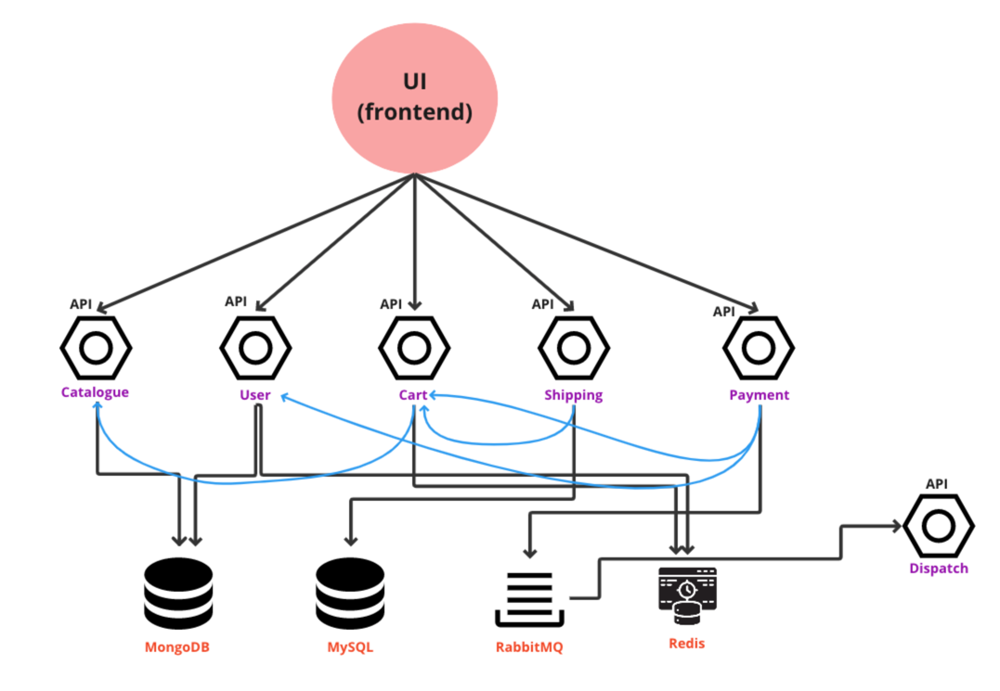

# Project Overview

Project is having the following components.

The following screenshots help us to understand whether our app is working or not after the setup is done.

1. **When we open roboshop landing page we should see list of categories.**

2. **I should be able to register and after registration, it should show the registered user information.**

3. **Going to categories and any product we should be able to add to cart.**

4. **Post checkout it should show countries.**

**Post that confirm also should show that final amount**

5. **Pay now should show that payment is done along with order id**

**By clicking on Login back it show the order history.**

